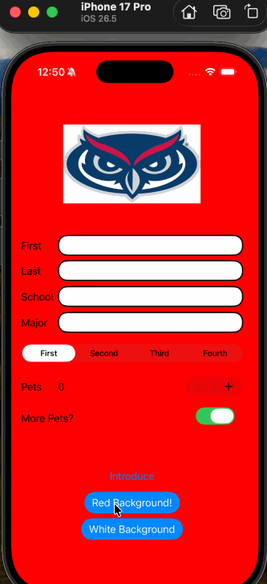

# COP4655-Lab0
Mobile App Projects Codepath Prework project

## Introduction App

### App Description

The introduction app allows users to enter their first name, last name, and the university they attend. Then, the user can select what year they are in at their unviersity, use a stepper to state the number of pets they have, then use a switch indicating whether the user does or does not want additional pets. 

### App Walk-though

 

### Required Features

- [x] 1. App displays an image of a school's logo
- [x] 2. App has three textfields for first, last, and school names
- [x] 3. App has a segmented control that changes student year
- [x] 4. Number of pet matches label is increased/decreased by stepper
- [x] 5. Switch makes a statement about wanting more pets or not(true/false) 
- [x] 6. Introduce yourself button shows alert box with an introduciton and dismiss button

### Optional Features

- [x] 1. User can tap a button to change the color of the background view (User can now change it to red, and then back to white)
- [x] 3. User can select on additional buttons that provide more info about the user. (User can now add their major into the app)
- [x] 4. Any stylistic changes that are not default options (I rounded the borders of the textboxes instead of their original rectangular form)
